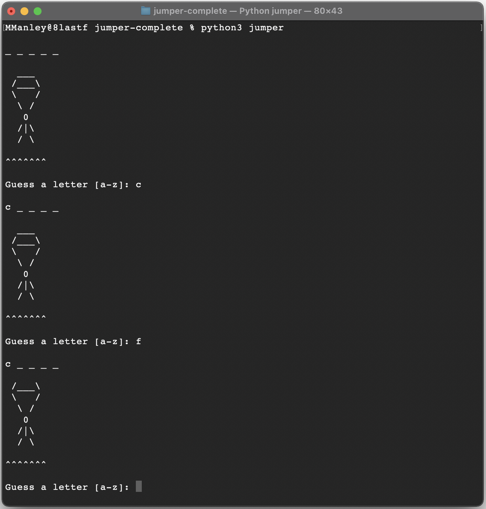
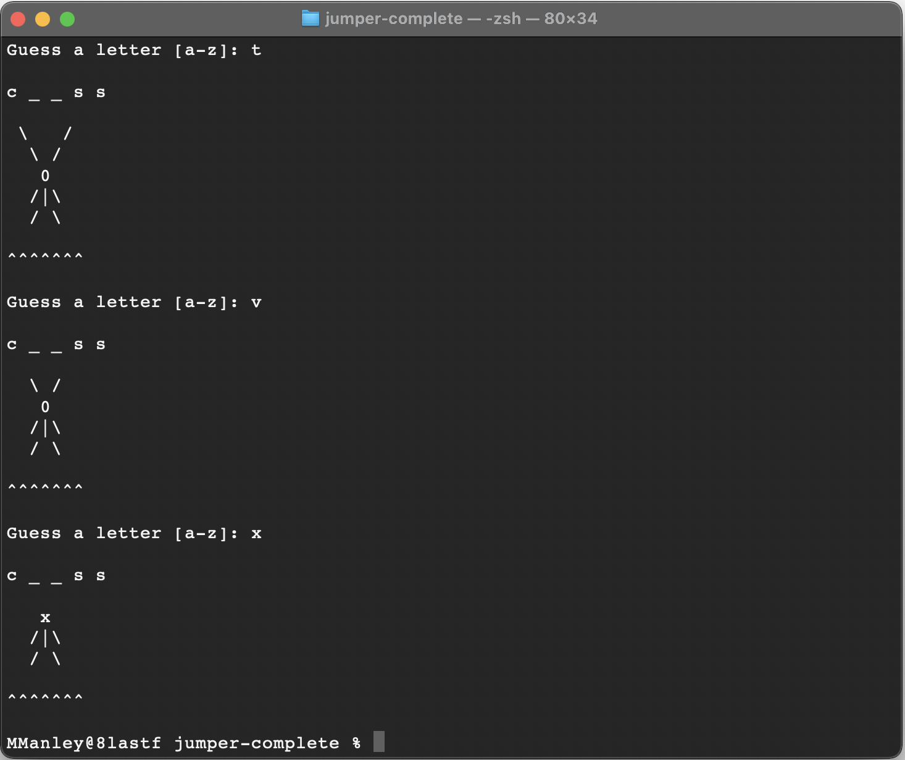

# Overview
---
Jumper is a game in which the player seeks to solve a puzzle by guessing the letters of a secret word one at a time.

[All of the documentation and images are taken from here](https://byui-cse.github.io/cse210-course-competency/encapsulation/materials/jumper-specification.html)

---
## Rules
---
Jumper is played according to the following rules:

* The puzzle is a secret word randomly chosen from a list.
* The player guesses a letter in the puzzle.
* If the guess is correct, the letter is revealed.
* If the guess is incorrect, a line is cut on the player's parachute.
* If the puzzle is solved the game is over.
* If the player has no more parachute the game is over.

---
## Interface

---

play continues until...

---
## Getting Started

---
Make sure you have Python 3.8.0 or newer installed and running on your machine. Open a terminal and browse to the project's root folder. Start the program by running the following command.

    python3 jumper

You can also run the program from an IDE like Visual Studio Code. Start your IDE and open the project folder. Select the main module inside the jumper folder and click the "run" button.

---
## Project Structure

---
The project files and folders are organized as follows:

root                    (project root folder)
+-- jumper              (source code for game)
  +-- game              (specific classes)
  +-- __main__.py       (program entry point)
+-- DESIGNDOC.md        (program design details)
+-- README.md           (general info)

---
## Required Technologies

---
* Python 3.8.0

---
## Authors

---
* Antonio Saucedo (antoniojesus@byui.edu)
* Godwin Iyip (iyi21001@byui.edu)
* Manuel Cipriano (cip21002@byui.edu)
* Shane Cook (scc0131@byui.edu)
* (Cole) Ukeje Chinemerem (uke21001@byui.edu)

---
*Shane Cook is the author of this document*